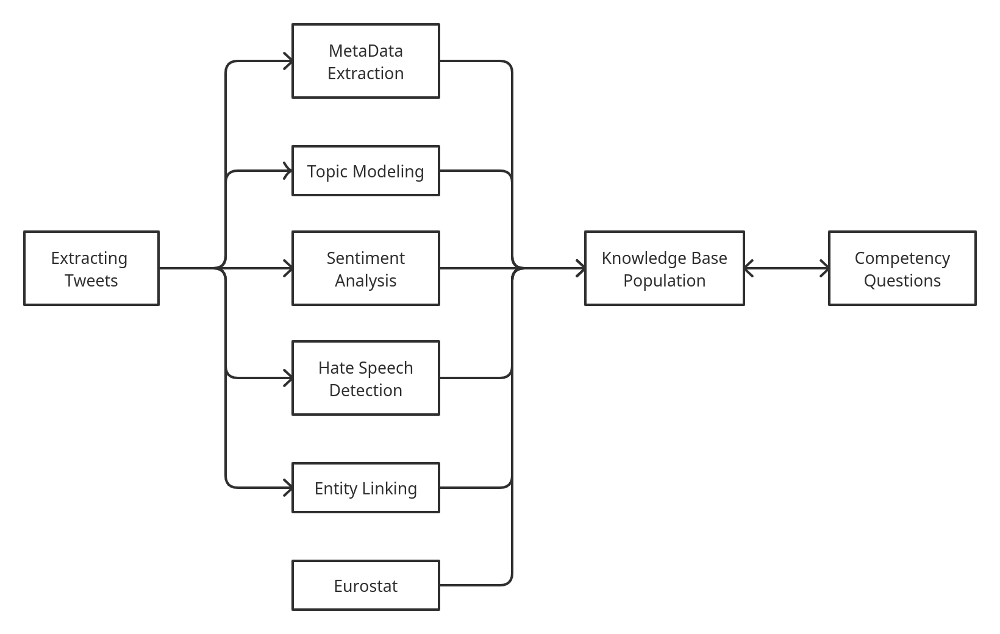
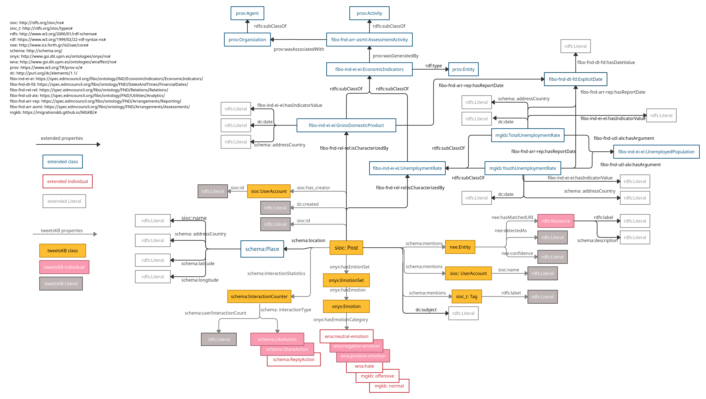

# MigrationsKB

## Overall Framework


## RDFS Model



## Links
* pretrained DL models and nt files for **MGKB** can be found on [Zenodo](https://zenodo.org/record/5206820#.YRqF1nUza0o)
* [Website](https://migrationskb.github.io/MGKB/) for statistics and examples of SPARQL queries
* preprint: Yiyi Chen, Harald Sack, Mehwish Alam, **MigrationsKB: A Knowledge Base of Public Attitudes towards Migrations and their Driving Factors**
  ([https://arxiv.org/abs/2108.07593](https://arxiv.org/abs/2108.07593))

## Pipeline

### 1. Extracting Tweets and Metadata
- crawl tweets
  - `python -m crawler.main_keywords`

### 2. Preprocessing
* a) restructure raw data
  - `python -m preprocessing.restructure_data`
  - input: raw data `data/raw`, output: processed data `data/preprocessed` json file.
* b). convert twitter data to panda DataFrames
    - `python -m preprocessing.dict2df`
    - input: output from 2.1 , output: csv file
* c) Tweet text preprocessing
  * `python -m preprocessing.text_preprocessor`
      - fileds: 
            ```
                author_id, conversation_id, text, id, created_at, lang, long, lat, hashtags,  
                user_mentions, reply_count, like_count, retweet_count, full_name, name, country,
                geo, country_code
            ```

### 3. Topic Modeling (ETM)
**Source code**: https://github.com/adjidieng/ETM (This is code that accompanies the paper titled "Topic Modeling in Embedding Spaces" by Adji B. Dieng, Francisco J. R. Ruiz, and David M. Blei. (Arxiv link: https://arxiv.org/abs/1907.04907))


* a) build data
  * `python -m topic_modeling.ETM.data_build_tweets`
  * input: preprocessed texts, output: bows and vocab pickle.
* b) pretrain skip-gram embeddings
  * `python -m topic_modeling.ETM.skipgram`
  * input: preprocessed texts, output: embeddings.txt
* c) train ETM
  * `python -m topic_modeling.ETM.main --num_topics XX`
  * For our experiments, ETM was trained with the number of topics 25/50/75/100
  * output: ETM models
* d) evaluate ETM
  * `python -m topic_modeling.ETM.main --num_topics 50 --load_from topic_modeling/ETM/models/etm_hateXplain_K_50_Htheta_800_Optim_adam_Clip_0.0_ThetaAct_relu_Lr_0.005_Bsz_1000_RhoSize_300_trainEmbeddings_0_val_ppl_3015.1_epoch_172 --tc 1 --td 1 --mode eval`
* e) build data for inferring topics on all Twitter texts
  * `python -m topic_modeling.ETM.data_build_for_inferring_topics --model_path XX --`

* f) infer topics for tweets
  * `python infer_topics.py --model_path models/etm_hateXplain_K_100_Htheta_800_Optim_adam_Clip_0.0_ThetaAct_relu_Lr_0.005_Bsz_1000_RhoSize_300_trainEmbeddings_0_val_ppl_2870.5_epoch_178 --num_topics 100 `
  * get `topic2words.json`


### 4. Entity Linking (Blink)
**Source code**: https://github.com/facebookresearch/BLINK (refer to paper by  Ledell Wu, Fabio Petroni, Martin Josifoski, Sebastian Riedel, Luke Zettlemoyer titled "Zero-shot Entity Linking with Dense Entity Retrieval" https://arxiv.org/pdf/1911.03814.pdf)

* a) set up Blink, and initialize the path in `entity_linking/main_linking.py` file
  * Go to [Blink](https://github.com/facebookresearch/BLINK)
* b) entity linking for tweets
  * `python -m entity_lining.tweet_entity_linking_all`
* c) post processing 
  * `python -m entitiy_linking.post_processing`
  * output: dataframe with linked entities, data/extracted/entities_dict.json
  

### 5. Sentiment Analysis

* `python -m sentiment_analysis.transfer_learning`
* pre-trained bert model: `models/Bert/BERT_6.bin`

### 6. Hate Speech Detection
* `python -m hate_speech_detection.transfer_learning`
* pre-trained HSD model: `models/HSD/model_epoch_1.pth`

### 7. Eurostats
All the csv files are in `data/eurostat_stats/csv`

Refer to `data/eurostat_stats/README.md` for references.

### 8. Post Processing
* Filter the tweets with refined topics.
  * relevant topics: 
    * [ 0,1,2,3,5,8,12,13,15,16,18,22,24,25, 29,32,34,36,41,42,45,47,48]
  * [topics and topic words](https://github.com/migrationsKB/MGKB/tree/master/topic_modeling/topic_words)
  

### 8. KB population
* Populate Knowledge Base
  * `python 01_populate_kb.py`
* Generate Documentation for RDF schema
  * `python 02_document_schema.py`


## Cite our Work
```
@misc{chen2021migrationskb,
      title={MigrationsKB: A Knowledge Base of Public Attitudes towards Migrations and their Driving Factors}, 
      author={Yiyi Chen and Harald Sack and Mehwish Alam},
      year={2021},
      eprint={2108.07593},
      archivePrefix={arXiv},
      primaryClass={cs.CL}
}
```
