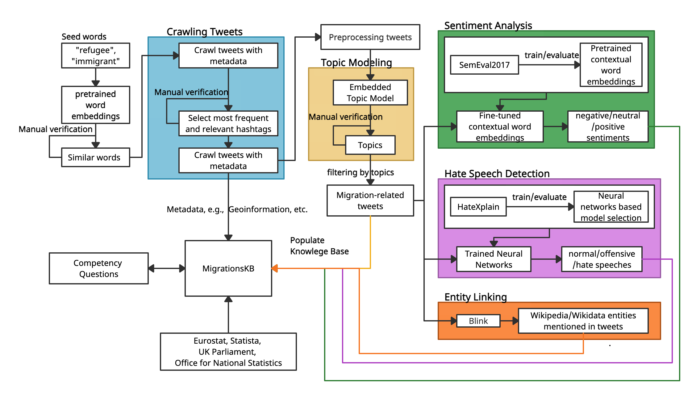
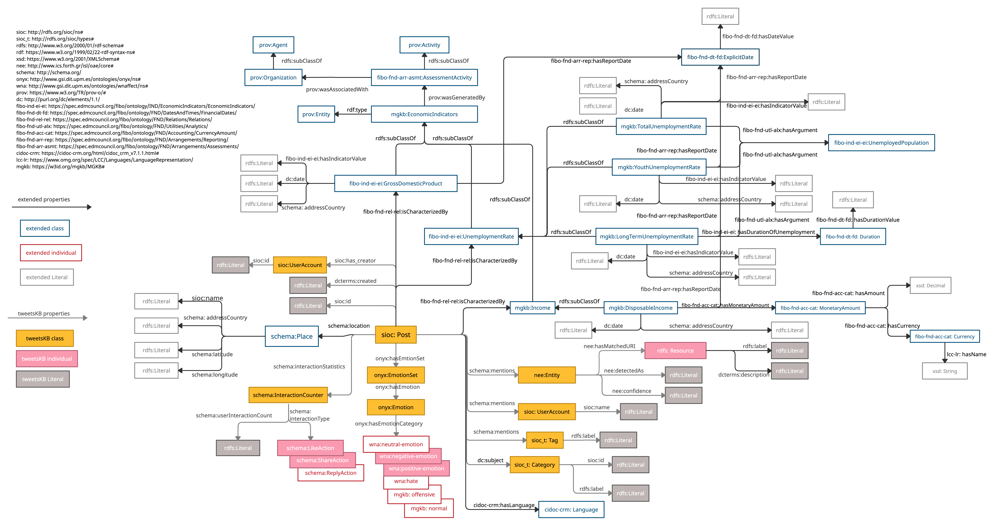

# MigrationsKB

## Overall Framework


## RDFS Model



## Links
* 📂 pretrained DL models and nt files for **MGKB** can be found on [Zenodo](https://zenodo.org/record/5206820#.YRqF1nUza0o)
* 🕸️ [Website](https://migrationskb.github.io/MGKB/) for statistics and examples of SPARQL queries
* 📃 preprint: Yiyi Chen, Harald Sack, Mehwish Alam, **MigrationsKB: A Knowledge Base of Public Attitudes towards Migrations and their Driving Factors**
  ([https://arxiv.org/abs/2108.07593](https://arxiv.org/abs/2108.07593))
* ❓ [SPARQL endpoint](https://mgkb.fiz-karlsruhe.de/sparql/)

## Install required libraries and packages
* Python version >=3.8
* pytorch (
  * Choose the right version of pytorch according to CUDA
  * For the settings (CUDA version 10.1, Driver Version: 418.39 and NVIDIA-SMI 418.39):
    * `pip install torch==1.8.1+cu101 torchvision==0.9.1+cu101 torchaudio==0.8.1 -f https://download.pytorch.org/whl/torch_stable.html`
  * Install other packages: The requirements for installing external packages are given in the requirement file. Run the following
    command:
    `pip install -r requirements.txt`

## File Structure of the repository
crawler → preprocessing → topic_modeling → entity_linking → sentiment_analysis → hate_speech_detection → populate_kb

Other folders include `analysis, data, images, utils`. Following are the details of each of these files.

1.	`analysis`: `script/notebooks` for analysing and generating plots for statistics of the results.

2.	`data`: 
○	`eurostat_stats` (files for statistics of asylum seekers and potential driving factors, which are explained in a README file)
○	`extracted` (the unique linked entities from entity linking, extracted and analysed hashtags for crawling tweets)

3.	`images`: images generated analysing the data and results from the models
○	`correlations`: plots describing correlations between negative/hate speech and potential driving factors for all the countries
○	`dist_plots`: plots describing distributions of the tweets before/after filtering, sentiments and hate speeches
○	`etm_dist`: distribution of tweets with different numbers of topics.

4.	`utils`: scripts for loading authentication file for Twitter API and other configuration files, helper functions for reading files.


## Using the Application
This section describes in detail how to run the software application for each of the modules step by step. 
All the commands are run in the root directory. The folder names are given at the end of the section headers 
inside parenthesis.

### 1. Extracting Tweets and Metadata (crawler)
The first step is to crawl the tweets based on migrations related keywords. 
In order to do so, an account of Twitter API for Academic Research is required. 
After obtaining the account, please put the bearer token in the file `crawler/config/credentials.yaml`.  
Create a folder `data/raw`. Run the following command:
  - `python -m crawler.main_keywords`

The outcome of this command is the crawled tweets in `gz` files as follows:
	`AT_20211220124316_2019-08-29T16:27:27.000Z.gz`

### 2. Preprocessing
The Tweets obtained in the previous step need to be preprocessed before giving them as input to the next core modules. 
Perform the following steps:
* a) Restructure crawled data
The input to the program is the ouput from the crawler, i.e., raw data:
  - `python -m preprocessing.restructure_data`
  - input: raw data `data/raw`, output: processed data `data/preprocessed` json file.
* b) Convert twitter data to panda DataFrames
    - `python -m preprocessing.dict2df`
    - input: output from 2.1 , output: csv file
* c) Tweet text preprocessing
  * `python -m preprocessing.text_preprocessor`
      - fileds: 
            ```
                author_id, conversation_id, text, id, created_at, lang, long, lat, hashtags,  
                user_mentions, reply_count, like_count, retweet_count, full_name, name, country,
                geo, country_code
            ```
  

### 3. Topic Modeling (ETM)
**Source code**: https://github.com/adjidieng/ETM (This is code that accompanies the paper titled "Topic Modeling in Embedding Spaces" by Adji B. Dieng, Francisco J. R. Ruiz, and David M. Blei.(Dieng et al. 2020) (Arxiv link: https://arxiv.org/abs/1907.04907))

The implementation is adjusted and integrated into our repository.
The scripts and their respective parameters:

1) The script `topic_modeling.ETM.main` is used to train and evaluate ETM (the c and d step in this section). For training ETM, the default parameters  from 
(Dieng et al. 2020) are used, and the parameter `--num_topics` can be set accordingly, for our usage,
it is either 25,50,75 or 100.

2) The script `topic_modeling.infer_topics` is used to predict topics for each tweet (the last step in this section), 
3) the following parameters should be set:
   * `--model_path` the file path of the pretrained ETM model to be loaded for inferring topics
   * `--data_path` the file path of the preprocessed tweets to be loaded for inferring topics
   * `--batch_size` the batch size of the data to be split for fed into pretrained ETM
   * `--num_words` the number of words to be shown for each topic
   * `--num_topics` the number of topics of the pretrained ETM


* a) Convert preprocessed tweets into formats that can be fed into ETM: 
  * `python -m topic_modeling.ETM.data_build_tweets`
  * input: preprocessed texts, output: bows and vocab pickle.
* b) pre-train skip-gram embeddings using the following command:
  * `python -m topic_modeling.ETM.skipgram`
  * input: preprocessed texts, output: embeddings.txt
* c) to train the ETM model using the following command, for example, train the ETM model with the number of topics 25:
  * `python -m topic_modeling.ETM.main --num_topics 25`
  * For our experiments, ETM was trained with the number of topics 25/50/75/100
  * output: ETM models
* d) to evaluate which ETM with the respective number of topics fits best for the Twitter data with the test dataset. For doing so, please run the following command with the best model for each number of topics:
  * `python -m topic_modeling.ETM.main --num_topics 50 --load_from topic_modeling/ETM/models/etm_hateXplain_K_50_Htheta_800_Optim_adam_Clip_0.0_ThetaAct_relu_Lr_0.005_Bsz_1000_RhoSize_300_trainEmbeddings_0_val_ppl_3015.1_epoch_172 --tc 1 --td 1 --mode eval`
* e) build data for inferring topics on all Twitter texts
  * `python -m topic_modeling.ETM.data_build_for_inferring_topics`

* f) to infer topics on all tweets with the best performing ETM.
  * `python infer_topics.py --model_path models/etm_hateXplain_K_100_Htheta_800_Optim_adam_Clip_0.0_ThetaAct_relu_Lr_0.005_Bsz_1000_RhoSize_300_trainEmbeddings_0_val_ppl_2870.5_epoch_178 --num_topics 100 `
  * get `topic2words.json`


### 4. Entity Linking (Blink)
**Source code**: https://github.com/facebookresearch/BLINK (refer to paper by  Ledell Wu, Fabio Petroni, Martin Josifoski, Sebastian Riedel, Luke Zettlemoyer titled "Zero-shot Entity Linking with Dense Entity Retrieval" https://arxiv.org/pdf/1911.03814.pdf)

* a) Set up Blink, and initialize the path in `entity_linking/main_linking.py` file:
  * Go to [Blink](https://github.com/facebookresearch/BLINK)
* b) Entity linking for tweets:
  * `python -m entity_lining.tweet_entity_linking_all`
* c) Merge the results from entity linking and results from sentiment analysis (5) and hate speech detection (6): 
  * `python -m entitiy_linking.post_processing`
  * output: dataframe with linked entities, data/extracted/entities_dict.json
  

### 5. Sentiment Analysis

* Change the model path accordingly in the `transfer_learning` script line 42 and run the following command:
    * `python -m sentiment_analysis.transfer_learning`
    * pre-trained bert model: `bert_models/BERT_6.bin`


### 6. Hate Speech Detection
* a) change the model path accordingly in the `hate_speech_detection.transfer_learning` script line 37, for example, 
  * `python -m hate_speech_detection.transfer_learning`
  * pre-trained HSD model: `hsd_models/model_epoch_1.pth`
* b) run the following command:
  * `python -m hate_speech_detection.transfer_learning`

### 7. Eurostats
All the csv files are in `data/eurostat_stats/csv`

Refer to `data/eurostat_stats/README.md` for references.

Update: the statistics for the latest version of MGKB:
`data/uk_eu/`, including income, long-term unemployment rate, total unemployment rate, youth unemployment rate and real GDP
growth rate.

### 8. Topics 
* Filter the tweets with refined topics.
  * relevant topics: 
    * [ 0,1,2,3,5,8,12,13,15,16,18,22,24,25, 29,32,34,36,41,42,45,47,48]
  * [topics and topic words](https://github.com/migrationsKB/MGKB/tree/master/topic_modeling/topic_words)
  

### 9. KB population
* Populate Knowledge Base
  * `python 01_populate_kb.py`
* Convert xml file to nt file:
  * `python 03_converter.py`

### 10. Factor Analysis
* The dataset for factor analysis:
  * `data/corr/working_dataset.csv`

* Factor analysis:
  * `notebooks/correlation_analysis.ipynb`

## Cite our Work
```
@misc{chen2021migrationskb,
      title={MigrationsKB: A Knowledge Base of Public Attitudes towards Migrations and their Driving Factors}, 
      author={Yiyi Chen and Harald Sack and Mehwish Alam},
      year={2021},
      eprint={2108.07593},
      archivePrefix={arXiv},
      primaryClass={cs.CL}
}
```
